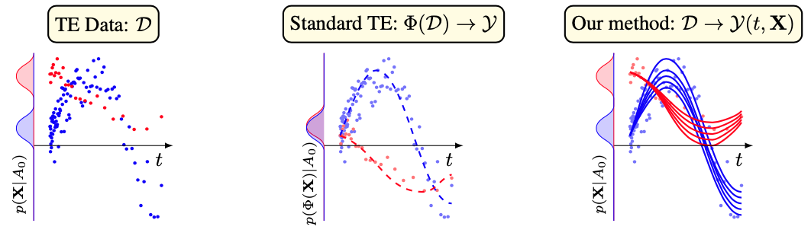

# [ICLR 2024 Spotlight] ODE Discovery for Longitudinal Heterogeneous Treatment Effects Inference

[](https://openreview.net/forum?id=pxI5IPeWgW)
[](https://opensource.org/licenses/MIT)
[](https://github.com/psf/black)

This repo holds the code, and log files for [ODE Discovery for Longitudinal Heterogeneous Treatment Effects Inference](https://openreview.net/forum?id=pxI5IPeWgW) by Samuel Holt, Jeroen Berrevoets, Krzysztof Kacprzyk, Zhaozhi Qian, and Mihaela van der Schaar.


#### Introduction

We introduce a different type of solution for the Longitudinal Heterogeneous Treatment Effects Inference: a closed-form ordinary differential equation (ODE). While we still rely on continuous optimization to learn an ODE, the resulting inference machine is no longer a neural network. Doing so yields several advantages such as interpretability, irregular sampling, and a different set of identification assumptions. Above all, we consider the introduction of a completely new type of solution to be our most important contribution as it may spark entirely new innovations in treatment effects in general. In the paper we contribute a framework that can transform any ODE discovery method into a treatment effects method. Using our framework, we build an example method called Individualized Nonlinear Sparse Identification Treatment Effect (INSITE). This is tested in accepted benchmark settings used throughout the literature.




#### Setup

To get started:

1. Clone this repo
```bash
git clone https://github.com/samholt/ODE-Discovery-for-Longitudinal-Heterogeneous-Treatment-Effects-Inference && cd ./ODE-Discovery-for-Longitudinal-Heterogeneous-Treatment-Effects-Inference
```

2. Follow the installation instructions in `setup/install.sh` to install the required packages.
```bash
./setup/install.sh
```

#### Replicating the main results

Open up a separate terminal and run `mlflow server --port=5000` to start the mlflow server.

In the main terminal, perform the following steps:
1. Modify the configuration files in folder `config`. The main config file that specifies baselines, datasets and other run parameters is in `config/config.yaml`
2. Run `python run.py` to run all baselines on all datasets. This will generate a log file in the `logs` folder.
2. Once a run has completed, process the log file generated output into the `logs` folder, with the script `process_result_file.py`. Note, you will need to edit the `process_result_file.py` to read this generated log file, i.e., specify the path variable of where it is. This will generate the main tables as presented in the paper.


### Cite

If you use our work in your research, please cite:

```bibtex
@inproceedings{
    holt2024ode,
    title={{ODE} Discovery for Longitudinal Heterogeneous Treatment Effects Inference},
    author={Samuel Holt and Jeroen Berrevoets and Krzysztof Kacprzyk and Zhaozhi Qian and Mihaela van der Schaar},
    booktitle={The Twelfth International Conference on Learning Representations},
    year={2024},
    url={https://openreview.net/forum?id=pxI5IPeWgW}
}
```